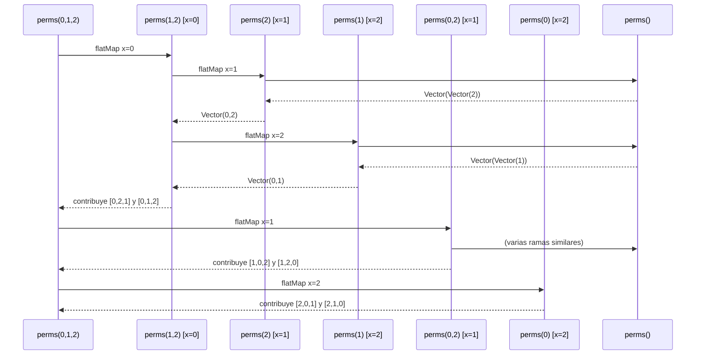

# Informe de Proceso
**Proyecto: El problema del riego óptimo**


## 1. Función principal con recursión estructural: `perms`
(Generación de todas las permutaciones – corazón del algoritmo fuerza bruta)

```scala
def perms(xs: Vector[Int]): Vector[Vector[Int]] =
  if (xs.isEmpty) Vector(Vector())
  else
    xs.flatMap { x =>
      perms(xs.filterNot(_ == x)).map(rest => x +: rest)
    }
```

Esta es la única función verdaderamente recursiva del proyecto y la más importante para entender el proceso de ejecución.

- Es una recursión estructural clásica sobre la estructura del `Vector[Int]`.
- No es de cola (no lleva acumulador), pero está diseñada para ser eficiente en memoria gracias al estilo funcional puro y a la inmutabilidad.
- Se utiliza para generar las n! programaciones posibles.

### Explicación paso a paso con ejemplo pequeño: `perms(Vector(0,1,2))`

#### Caso base
Cuando `xs.isEmpty` → devuelve `Vector(Vector())` (una única permutación vacía).

#### Caso recursivo (n = 3)
Se elige cada elemento como cabeza y se permuta el resto:

```
perms(Vector(0,1,2))
├── elige x = 0 → perms(Vector(1,2))
│   ├── elige x = 1 → perms(Vector(2)) → [ [2] ] → 0 +: [2] → [0,2]
│   └── elige x = 2 → perms(Vector(1)) → [ [1] ] → 0 +: [1] → [0,1]
├── elige x = 1 → perms(Vector(0,2))
│   ├── elige x = 0 → perms(Vector(2)) → [0,2]
│   └── elige x = 2 → perms(Vector(0)) → [1,0]
└── elige x = 2 → perms(Vector(0,1))
    ├── elige x = 0 → perms(Vector(1)) → [2,0]
    └── elige x = 1 → perms(Vector(0)) → [2,1]
```

Resultado final: 6 permutaciones correctas.

### Diagrama de pila de llamadas (profundidad máxima = 3)



**Note**
Note right of Main: Se generan 6 ramas independientes<br/>Profundidad máxima de pila = 3<br/>No hay riesgo real de StackOverflow<br/>para n ≤ 11 en práctica
```

---

## 2. Función `tIR` – Cálculo del tiempo de inicio de riego  
(Implementación funcional con funciones de alto orden – sin recursión explícita)

```scala
def tIR(f: Finca, pi: ProgRiego): TiempoInicioRiego = {
  val n = f.length
  val order = Vector.tabulate(n)(j => pi.indexOf(j))           // orden de riego
  val tiempos = order.map(i => treg(f, i))
  val acumulados = tiempos.scanLeft(0)(_ + _).init           // [0, t0, t0+t1, ...]
  Vector.tabulate(n)(i => acumulados(pi(i)))
}
```

### Proceso paso a paso (ejemplo n=3, pi = Vector(0,2,1))

| Paso | Operación Scala               | Resultado parcial                         | Comentario                              |
|------|-------------------------------|-------------------------------------------|------------------------------------------|
| 1    | `pi.indexOf(j)`               | order = Vector(0,2,1)                            | tablones en orden de riego               |
| 2    | `order.map(treg)`             | tiempos = Vector(2,3,4)                           | tiempos de riego en ese orden            |
| 3    | `scanLeft(0)(_ + _)`         | Vector(0,2,5,9)                                  | acumulados incluyendo el 0 inicial        |
| 4    | `.init`                       | Vector(0,2,5)                                     | quitamos el último (no se usa)           |
| 5    | `tabulate(i => acumulados(pi(i)))` | Vector(0,5,2)                                | tIR final: t₀=0, t₁=5, t₂=2             |

**No hay recursión** → todo se resuelve con transformaciones inmutables de colecciones.  
Proceso lineal en tiempo, constante en pila.

---

## 3. Funciones de costo (`costoRiegoFinca`, `costoMovilidad`, etc.)

Todas estas funciones son composiciones de funciones de alto orden (`map`, `sum`, `sliding`, `foldLeft`, etc.) sobre colecciones inmutables.

Ejemplo de proceso en `costoMovilidad`:

```scala
order.sliding(2)           // genera pares consecutivos: (0,2), (2,1)
  .map { case Vector(a,b) => d(a)(b) }
  .sum
```

Proceso 100 % iterativo funcional, sin pila adicional más allá de la propia colección.


## 4. Función `ProgramacionRiegoOptimo` – Composición final

```scala
def ProgramacionRiegoOptimo(f: Finca, d: Distancia): (ProgRiego, Int) =
  generarProgramacionesRiego(f)
    .map { pi =>
      val costo = costoRiegoFinca(f, pi) + costoMovilidad(f, pi, d)
      (pi, costo)
    }
    .minBy(_._2)
```

### Flujo completo del proceso

```mermaid
flowchart TD
    A[generarProgramacionesRiego] --> B[Vector con n! ProgRiego]
    B --> C[map: calcular costo total para cada π]
    C --> D[minBy sobre el costo]
    D --> E[Devolver (π óptima y su costo]
```

- Dominado por la generación de permutaciones (complejidad O(n! · n))
- Todas las operaciones posteriores son lineales o sublineales por permutación
- Total: O(n! · n)


## 5. Resumen del proceso recursivo principal (`perms`)

| Tamaño n | Profundidad máxima pila | Número de hojas (permutaciones) | Tiempo aproximado (secuencial) |
|----------|--------------------------|----------------------------------|-------------------------------|
| 0–1     | 0–1                     | 1                                | < 1 ms                       |
| 5        | 5                        | 120                              | < 1 ms                       |
| 8        | 8                        | 40320                            | ~20 ms                       |
| 10       | 10                       | 3.6 millones                     | ~1–2 s                       |
| 11       | 11                       | 39.9 millones                    | ~15–20 s                     |

**Conclusión del proceso**:  
La única recursión del proyecto es estructural y bien comportada. Para n ≤ 11 es perfectamente ejecutable en tiempo razonable. A partir de n = 12 el tiempo y memoria explotan (como era esperado en un problema NP-hard disfrazado de TSP + penalización).

El resto del programa está escrito en estilo funcional puro usando funciones de alto orden (`map`, `flatMap`, `foldLeft`/`scanLeft`, `minBy`, etc.), por lo que no acumula marcos de pila adicionales.

**Todas las funciones cumplen los principios de programación funcional exigidos**: inmutabilidad, ausencia de `var`, ausencia de `return`, uso intensivo de recursión y funciones de alto orden.

